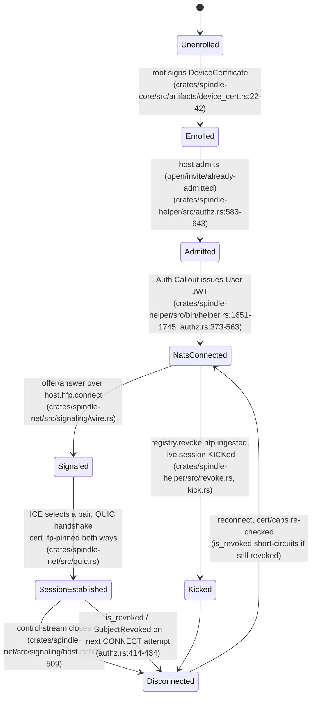
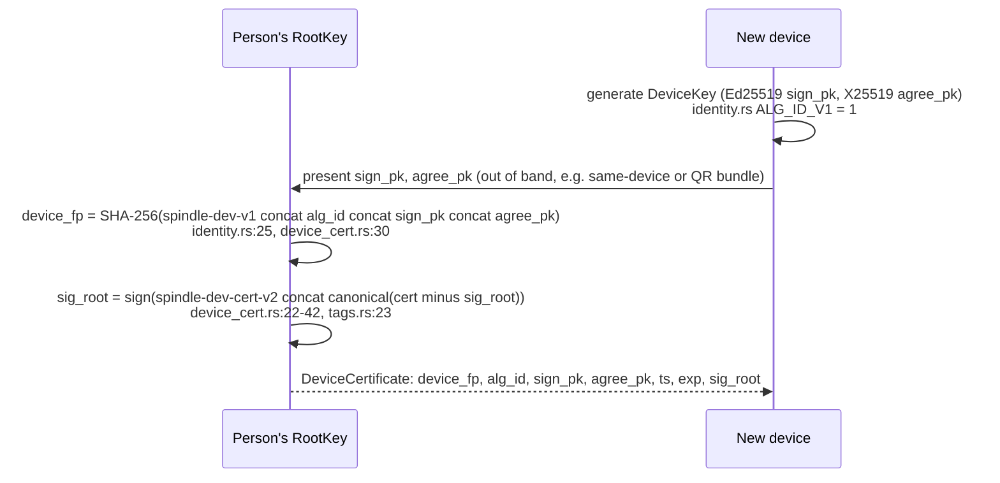
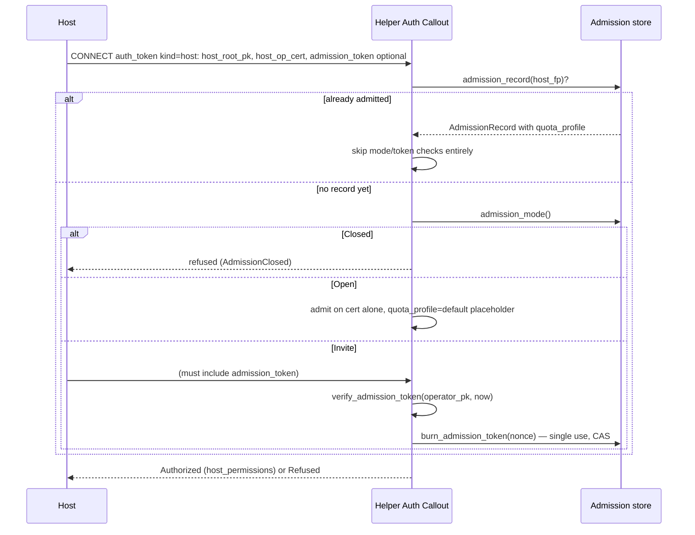
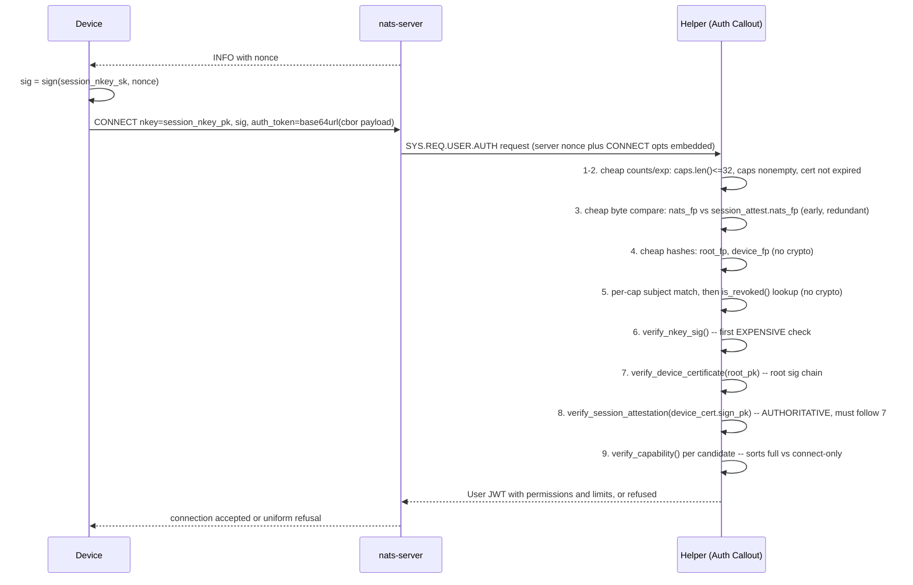
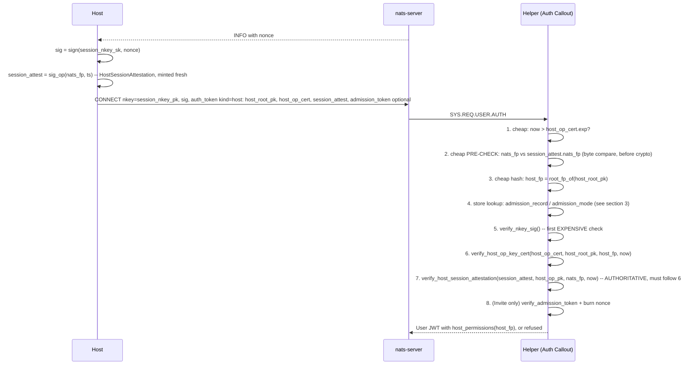
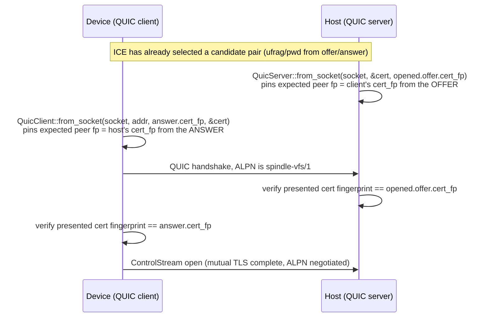

# Spindle Handshakes: A Visual Reference

Spindle connects two kinds of parties: a **device** (client — a person's phone, laptop, etc.)
and a **host** (server — the machine exposing a filesystem over the VFS). Both parties answer to
one of three trust roots:

- **A person's root key** (`RootKey`, `crates/spindle-core/src/identity.rs:44-79`) — signs
  `DeviceCertificate`s for every device the person owns. `root_fp = SHA-256(root_pk)`
  (`identity.rs:88-90`).
- **A host's root key** — a *different* `RootKey` instance, owned by whoever runs the host. It
  never signs directly; it certifies a short-lived **operating key** via `HostOpKeyCert`
  (`crates/spindle-core/src/artifacts/host_op_key_cert.rs:9-25`), and the operating key does the
  day-to-day signing (capabilities, revocations, the host's own envelope identity).
- **The registry operator** — a third key, orthogonal to both identity roots, that signs
  `AdmissionToken`s (invites) and `AdminCommand`s (out-of-band operator actions). It never
  authenticates a live connection by itself.

**Why several handshakes instead of one:** each layer answers a different question and is
independently replaceable. NATS CONNECT answers "who is allowed onto the message bus, with what
subjects" (a transport-level, per-process concern). The A7 signaling envelope answers "is this
device end-to-end who it claims to be" (independent of which NATS user token it happens to be
using this session). QUIC answers "did ICE actually punch a hole to the same peer the signaling
layer just authenticated" (fingerprint pinning closes the gap between the signaling identity and
the transport socket). Collapsing these into one check would mean every future change to any one
concern reopens all the others.

---

## 1. Lifecycle



Two things do **not** advance this diagram the way you might expect:

- Enrollment produces a `DeviceCertificate`, but that alone grants no host access — a device is
  "enrolled" only in the sense that it has root-signed identity material. It only becomes useful
  once a host issues it a `Capability` (§3a/§3b below).
- "Admitted" and "NATS-connected" are drawn as separate states for hosts (which persist an
  `AdmissionRecord`) but collapse into one edge for devices (the callout evaluates capabilities
  and a session key in the same request — there is no separate device-admission record).

---

## 2. Enrollment: root-signed `DeviceCertificate`

A device becomes usable once the person's root key signs a `DeviceCertificate` binding an
Ed25519 signing key and an X25519 agreement key to a `device_fp`.



### Data carried

| Field | Meaning | Source |
|---|---|---|
| `device_fp` | `SHA-256("spindle-dev-v1" \|\| alg_id \|\| sign_pk \|\| agree_pk)` — recomputed and compared by every verifier, never trusted as a bare label | `crates/spindle-proto/src/artifacts.rs:595-603`, `identity.rs:25` |
| `alg_id` | Suite version; `1` = Ed25519/X25519/AES-256-GCM, no fallback suite (§A11 decision) | `identity.rs:22-23` |
| `sign_pk` / `agree_pk` | The device's Ed25519 and X25519 public keys — this is the *signed material* that binds the certificate to a specific key pair (A10.34) | `artifacts.rs:597-598` |
| `ts` / `exp` | Issue time; expiry roughly 1 year, "re-signed on contact" per the verify doc comment | `crates/spindle-core/src/artifacts/device_cert.rs:44-52` |
| `sig_root` | `Ed25519(root_sk, "spindle-dev-cert-v2" \|\| canonical(cert \ sig_root))` | `artifacts.rs:660-666`, `tags.rs:23` |

Note there is **no `nats_fp` field** on this certificate — it was removed in v0.9.29/A10.39
(`tags.rs:19-23`) precisely because a certificate-embedded session binding is exactly the shape
that produced td-0bcab4 (§6 below). Binding to a session nkey is now `SessionAttestation`'s job,
issued fresh per connection, not baked into the long-lived certificate.

There is a second, unrelated bootstrap artifact — the **device bootstrap bundle**
(`crates/spindle-core/src/artifacts/bootstrap.rs:1-11`), a QR-transferable bundle of a person's
existing member capabilities used to add a *new* device to hosts it's already a member of. It
carries `host_fp`/`host_device_fp` values that are explicitly **derived, never carried on the
wire** (`bootstrap.rs:7-11`) — this is not one of the 9 signed artifact types (`tags.rs`) and
carries no signature of its own; it is unsigned by design (see the module's own note pointing at
`spindle-proto::bootstrap`'s doc comment).

---

## 3. Host admission (§A3b): first connect vs. later connects

Before a *host* itself can use NATS, it must be admitted by whatever admission policy the
registry/operator has configured. This is evaluated inside the same callout request as the
host's CONNECT (§4b below); it is presented here separately because the decision has its own
state machine.



### Data carried

| Field | Meaning | Source |
|---|---|---|
| `AdmissionToken.nonce` | Single-use invite token; burned on first successful use (CAS in the durable store) | `crates/spindle-proto/src/artifacts.rs:493-499`, `crates/spindle-core/src/artifacts/admission_token.rs:24-37` |
| `.exp` | Absolute Unix-seconds expiry, days-scale | `admission_token.rs:24-25` |
| `.label` / `.quota_profile` | Human label and the quota tier this admission grants | `artifacts.rs:493-499` |
| `.sig_operator` | `Ed25519(operator_sk, "spindle-adm-v1" \|\| canonical(token \ sig_operator))` | `artifacts.rs:544-550`, `tags.rs:18` |

An already-admitted host **connects on its cert alone** — no token, no mode check — every time
after the first (`crates/spindle-helper/src/authz.rs:610-613` comment: "the callout checks the
admission record"). `AdmissionMode::Open` admits without ever writing a real quota profile; the
code's own comment flags this as a known gap: "DESIGN.md §A3b's `open` mode ... describes no
admission-record write and no quota-profile source for open-mode hosts" (`authz.rs:648-651`).

---

## 4a. NATS CONNECT — device path (Auth Callout)

This is where a device's static identity material (root, cert, capabilities) is combined with
proof of possession of the ephemeral **session nkey** this one NATS connection is using. Two
independent Ed25519 checks happen here, over two different keys, and — per td-0bcab4 — the order
in which they're trusted matters.



**Ordering, exactly as coded** (`crates/spindle-helper/src/authz.rs:373-563`) — note this is
*more precise* than "cheap checks → nkey sig → device cert → root_fp → session attestation →
caps → revocation": revocation is actually checked in step 5, **before** any signature
verification at all, specifically so a revoked device never costs the callout an Ed25519
verification (`authz.rs:410-416` comment):

1. `caps.len() > 32` → `TooManyCapabilities` (`authz.rs:381-383`)
2. `caps.is_empty()` → `NoCapabilitiesPresented` (`authz.rs:384-386`)
3. `now > device_cert.exp` → `DeviceCertificateExpired` (`authz.rs:389-391`)
4. cheap byte compare `nats_fp` vs `session_attest.nats_fp` → `BadSessionAttestation` — deliberately
   redundant with step 8, purely to reject cheaply before any crypto (`authz.rs:393-407`)
5. cheap hashes: `root_fp = root_fp_of(root_pk)`, `device_fp` from cert bytes (`authz.rs:409-412`)
6. per-candidate subject match, then `view.is_revoked(host_fp, root_fp/device_fp)` →
   `SubjectRevoked` refuses the **whole connection**, before any signature check
   (`authz.rs:414-434`)
7. `verify_nkey_sig()` (lazy closure — the server-nonce signature) → `BadNkeySignature`
   (`authz.rs:439-441`)
8. `verify_device_certificate(root_pk, root_fp, now)` → `BadDeviceCertificate`
   (`authz.rs:442-451`)
9. `verify_session_attestation(device_cert.sign_pk, nats_fp, now)` — **must run after step 8**;
   verifying an attestation against an unverified cert's `sign_pk` would let an attacker name
   their own key (`authz.rs:453-480`, comment explicitly explains why the ordering is load-bearing)
10. per-candidate `verify_capability(cap, now)` — `Member` kind + fresh epoch → full member;
    `Invite` kind, or expired-but-signature-valid `Member` → connect-only renewal path
    (`authz.rs:482-509`)
11. merge permissions, mint jittered `Limits`, persist `SessionRecord`, return `Authorized`
    (`authz.rs:511-563`)

### Data carried

| Field | Meaning | Source |
|---|---|---|
| `INFO.nonce` | Server-issued per-connection nonce the client must sign with its session nkey | `crates/spindle-helper/src/bin/helper.rs:67-70` (module doc) |
| `CONNECT.nkey` / `.sig` | The session nkey and its signature over `nonce` — proves possession of the *transport* key only | `helper.rs:1685-1741` |
| `CONNECT.auth_token` | base64url(canonical CBOR) of `{kind:"device", root_pk, device_cert, session_attest, caps: [...]}` — each inner field itself a nested `to_canonical_bytes()` blob | `crates/spindle-helper/src/auth_token.rs:13-18` |
| `session_attest` | `SessionAttestation{nats_fp, ts, sig_device}` — signed by the device's **identity** key, binding it to this connection's nkey; required, not optional | `crates/spindle-proto/src/artifacts.rs:698-703`, `crates/spindle-core/src/artifacts/session_attest.rs:11-28` |
| `caps[i]` | Each a `Capability` naming this device's `root_fp` as `subject` for some `host_fp` | `crates/spindle-proto/src/artifacts.rs:395-409` |

**SessionAttestation binds device identity to *this* nkey, and this check runs strictly after
the device certificate is verified** (step 8 before step 9 above) — verified directly in
`authz.rs:453-467`'s comment: *"`presented.device_cert.sign_pk` is only trustworthy once the
certificate carrying it has been verified against the pinned root above."* This is the fix for
td-0bcab4: before `SessionAttestation` existed, `{root_pk, device_cert, caps}` alone was a
bearer bundle — anyone holding a copy could connect from *any* nkey
(`session_attest.rs:15-20`).

---

## 4b. NATS CONNECT — host path

Since v0.9.31 (td-583db5), the host path mirrors the device path's two-tier binding check (§4a)
almost exactly, just with its own pair of artifacts. `HostOpKeyCert` is issuance-chain only now —
embedded in every `Capability` and `HostDeviceCert` so a verifier can walk root → operating key,
with no per-connect binding of its own. The host's per-connect NATS binding lives in a separate
artifact, `HostSessionAttestation { nats_fp, ts, sig_op }`, signed fresh by the host's **operating**
key on every connect attempt — the exact host-side mirror of the device's `SessionAttestation`.
Because the operating key is warm (it already signs `Capability` at issuance time) while the root
stays cold, the host's session nkey is per-session again, not the long-lived nkey earlier revisions
of this document described.



Step 2 is a cheap pre-check, not the authority — that's step 7, and it can only run after step 6
succeeds:

> "A cheap early rejection, not the authoritative check — that's the authoritative check below,
> after `verify_host_op_key_cert` succeeds. This is a byte comparison against the caller-supplied
> `nats_fp`... so a stolen `{host_root_pk, host_op_cert, session_attest}` bundle replayed from an
> attacker's own nkey gets refused here rather than costing the callout two Ed25519
> verifications..." — `crates/spindle-helper/src/authz.rs:614-619`

> "Verifying `session_attest` against an *unverified* cert's `host_op_pk` would let an attacker
> present a self-made cert naming their own key and satisfy the attestation with a signature they
> produced themselves — checking a signature against a key the attacker chose proves nothing — so
> this check belongs after cert verification..." — `crates/spindle-helper/src/authz.rs:694-697`

### Data carried

| Field | Meaning | Source |
|---|---|---|
| `CONNECT.auth_token` | base64url(canonical CBOR) of `{kind:"host", host_root_pk, host_op_cert, session_attest, admission_token?}` | `crates/spindle-helper/src/auth_token.rs:16-18` |
| `HostOpKeyCert.host_op_pk` | The host's current operating key, certified by the host root — issuance chain only, embedded in every `Capability`/`HostDeviceCert` | `crates/spindle-proto/src/artifacts.rs:934-939` |
| `.ts` / `.exp` | Issue time / expiry — roughly 90 days per the verify doc comment | `crates/spindle-core/src/artifacts/host_op_key_cert.rs:31-35` |
| `.sig_host_root` | `Ed25519(host_root_sk, "spindle-host-cert-v2" \|\| canonical(cert \ sig_host_root))` | `crates/spindle-proto/src/artifacts.rs:984-990`, `crates/spindle-proto/src/tags.rs:33` |
| `session_attest` | `HostSessionAttestation{nats_fp, ts, sig_op}` — signed by the host's **operating** key, binding it to this connection's nkey; required, not optional, minted fresh per connect | `crates/spindle-proto/src/artifacts.rs:1026-1030`, `crates/spindle-core/src/artifacts/host_session_attest.rs:34-49` |

Two distinct fingerprints matter here and are **never interchangeable**: `host_fp` (root-derived,
`SHA-256(host_root_pk)`, scopes every `host.<hfp>.>` NATS subject) versus `host_device_fp` (the
host's own A7 envelope identity — a `HostDeviceCert`, §5 below). A `HostOpKeyCert` carries no
`nats_fp` at all — only `host_op_pk`, `ts`, `exp`, `sig_host_root` — and has nothing to do with the
host's envelope identity.

---

## 5. Signaling handshake: offer → answer → trickle ICE

Once both device and host are NATS-connected, the device sends a connect offer on
`host.<host_fp>.connect`. Everything from here on is wrapped in an A7 `Envelope`
(`crates/spindle-proto/src/artifacts.rs:252-263`) — end-to-end authenticated and encrypted,
independent of whatever NATS user token happens to be carrying the bytes.

```mermaid
sequenceDiagram
    participant Dev as Device
    participant Nats as host.hfp.connect (NATS)
    participant Host

    Dev->>Dev: k0 = HKDF(X25519(eph_c, host_agree_pk) plus X25519(dev_agree_c, host_agree_pk), info=spindle-sess-boot-v1 etc)
    Dev->>Dev: seal_offer: AES-256-GCM(k0, OfferPayload) then sign envelope
    Dev->>Nats: publish Envelope kind=offer, eph_pk=eph_pk_c, reply=INBOX_devfp.xyz
    Nats->>Host: deliver (host subscribes host.hfp.connect)
    Host->>Host: reply_prefix_ok(reply, from_fp)? cheap INBOX prefix check first
    Host->>Host: open_offer: k0prime = HKDF(X25519(host_device_sk, eph_pk_c) plus X25519(host_device_sk, sender_agree_pk), ...)
    Host->>Host: decrypt and verify OfferPayload; check inbox equals transport reply subject
    Host->>Host: seal_answer: k1 = HKDF(X25519(eph_h, eph_pk_c) plus dev_dh, info=spindle-sess-v1 etc)
    Host-->>Dev: reply Envelope kind=answer, eph_pk=eph_pk_h, member_cap optional
    Dev->>Dev: open_answer: k1prime = HKDF(X25519(eph_c, eph_pk_h) plus dev_dh, ...)
    loop trickle ICE
        Dev->>Host: Envelope kind=ice on host.hfp.sess.devfp.sid.c2h, sealed under k1
        Host->>Dev: Envelope kind=ice on host.hfp.sess.devfp.sid.h2c, sealed under k1
    end
```

### Envelope fields and receiver MUST-checks

`Envelope { v, alg_id, from_fp, to_fp, sid, kind, seq, ts, eph_pk?, ciphertext, sig }`
(`crates/spindle-proto/src/artifacts.rs:252-263`). Its signing input is uniquely
`tag || canonical(header) || ciphertext` — **not** `tag || canonical(whole struct minus sig)` the
way every other artifact works (`artifacts.rs:341-344` comment explicit about this exception).

`open()`'s checks run in this exact order (`crates/spindle-core/src/envelope.rs:275-343`), and
every one maps to exactly one `EnvelopeError` variant so a negative test can isolate it
(`envelope.rs:156-183`):

1. `v >= min_v` → `VersionTooLow` (`envelope.rs:276-279`)
2. `alg_id >= min_alg_id` → `AlgIdTooLow` (`envelope.rs:281-286`)
3. Ed25519 signature under the pinned sender key → `BadSignature`/`InvalidSignatureEncoding`
   (`envelope.rs:290-299`)
4. `to_fp == self_fp` → `WrongRecipient` (`envelope.rs:300-302`)
5. `sender_revoked` → `SenderRevoked` (`envelope.rs:303-305`)
6. `sid == expected_sid` → `SidMismatch` (`envelope.rs:306-308`)
7. `bound_from_fp` (if `Some`) matches `from_fp` → `SidBoundToDifferentSender`
   (`envelope.rs:309-313`)
8. `seq` strictly greater than `min_seq_exclusive` → `ReplaySeq` (`envelope.rs:314-317`)
9. `|ts - now| <= CLOCK_SKEW_SECS` (120s) → `ClockSkew` (`envelope.rs:319-322`)
10. `kind == expected_kind` → `KindMismatch` (`envelope.rs:323-325`)
11. AES-256-GCM decrypt with AAD = canonical header → `DecryptFailed` (`envelope.rs:340-343`)

| Field | Carried in | Purpose |
|---|---|---|
| `inbox` | `OfferPayload` | Client's real NATS reply subject, bound into *signed* material so a broker that swaps the transport reply-to can only deny service, never silently redirect (`crates/spindle-proto/src/signaling.rs:226-236`) |
| `transport` / `ufrag` / `pwd` / `cert_fp` | `OfferPayload` (239-244), `AnswerPayload` (304-309) | ICE short-term credentials (RFC 8445 §5.3) and each side's own QUIC self-signed cert fingerprint |
| `member_cap` | `AnswerPayload` | The host's current `Capability` for this device, re-issued on **every** successful answer — the only channel a connect-only device can receive a refreshed cap over (`signaling.rs:286-297`) |
| `candidate` / `end_of_candidates` | `IcePayload` (367-370) | One SDP `a=candidate` line, or an explicit end-of-gathering marker |

**Key schedule (two keys per session, `crates/spindle-core/src/envelope.rs:1-35`):**

| Key | Used for | DH term 1 (`eph_dh`) | DH term 2 (`dev_dh`) | `info` domain |
|---|---|---|---|---|
| `k0` | offer only | `X25519(eph_c, host_agree_pk)` — client ephemeral × host static | `X25519(dev_agree_c, host_agree_pk)` — client static × host static | `spindle-sess-boot-v1` (`envelope.rs:53`) |
| `k1` | answer + everything after, both directions | `X25519(eph_self, eph_peer)` — fully ephemeral | `X25519(dev_self, dev_agree_peer)` — same static-static term reused | `spindle-sess-v1` (`envelope.rs:49`) |

Verified directly against the call sites in `crates/spindle-net/src/signaling/wire.rs`:
`seal_offer` (98-108) and `open_offer` (194-205) construct `k0` from the client/host ephemeral-vs-
static pairing; `open_answer` (129-141) and `seal_answer` (245-254) construct `k1` from a fresh
ephemeral-ephemeral pairing plus the same reused device-static term. `k0` exists only because the
client cannot know the host's ephemeral key before the host replies — using the host's *static*
agreement key for the first message's ephemeral term is what makes the offer decryptable at all
(`envelope.rs:16-24`).

A cheap, non-cryptographic check runs before any of this: `reply_prefix_ok` verifies the NATS
reply subject starts with `_INBOX_<from_fp>.` — proven empirically necessary because NATS itself
does **not** verify a reply-to subject belongs to its claimed sender
(`crates/spindle-net/src/signaling/subject.rs:139-146`, citing `spikes/s2-signaling`'s live
measurement).

---

## 6. QUIC session establishment

Fingerprint pinning is not deferred wiring — it runs end-to-end, using the exact `cert_fp` values
carried inside the already-A7-verified offer/answer:



### Data carried / facts

| Fact | Value | Source |
|---|---|---|
| ALPN token | `b"spindle-vfs/1"` — QUIC (RFC 9001 §8.1) requires ALPN negotiation to succeed | `crates/spindle-net/src/quic.rs:68` |
| `cert_fp` length | 32 bytes | `crates/spindle-proto/src/signaling.rs:61` |
| Host pins | `opened.offer.cert_fp` — the client's declared cert fingerprint, arrived inside the A7-verified offer | `crates/spindle-net/src/signaling/host.rs:506` |
| Client pins | `answer.cert_fp` — the host's declared cert fingerprint, arrived inside the A7-verified answer | `crates/spindle-net/src/signaling/client.rs:306` |
| Post-verification guarantee | `opened.from_fp` is authenticated, not merely claimed, by the time `handle_session` runs — `process_offer` resolved it and `open_offer` verified the signature against the `sign_pk` that lookup returned | `crates/spindle-net/src/signaling/host.rs:507-509` (comment) |

Because the fingerprint each side pins was carried inside a signed, decrypted A7 envelope (not a
bare unauthenticated QUIC handshake parameter), a man-in-the-middle on the raw UDP path cannot
substitute its own certificate: it would need to also forge the signaling envelope's Ed25519
signature to change the fingerprint the peer expects.

---

## 7. Revocation / kick

```mermaid
sequenceDiagram
    participant Signer as Host op key / identity root
    participant Nats as registry.revoke.hfp
    participant Helper
    participant Server as nats-server
    participant Session as Live client session

    Signer->>Nats: publish RevocationRecord: host_fp, epoch, revoked list, ts, sig
    Helper->>Helper: parse subject to get subject_host_fp
    Helper->>Helper: record.host_fp equals subject_host_fp? identity check, not a signature check
    Helper->>Helper: is_newer_epoch? max-wins per host_fp and subject
    Helper->>Helper: store revocation; compute KickMap targets for now-revoked live sessions
    Helper->>Server: SYS.REQ.SERVER.server_id.KICK with cid
    Server-->>Session: connection forcibly closed
    Note over Helper,Server: Later reconnect attempt: authz.rs is_revoked step refuses before any signature check is even attempted
```

### Data carried

| Field | Meaning | Source |
|---|---|---|
| `RevocationRecord.host_fp` | The record's own claimed subject-of-authority — **must** equal the NATS subject token it arrived on | `crates/spindle-proto/src/artifacts.rs:758-764`, `crates/spindle-helper/src/revoke.rs:156-158` |
| `.epoch` | Monotonic counter; a newer epoch always wins over an older one (`is_newer_epoch`) | `revoke.rs:36` |
| `.revoked` | List of revoked subject fingerprints (root_fp or device_fp) under this host | `artifacts.rs:758-764` |
| `.sig` | Signed by the host op key **or** an identity root — either can revoke | `tags.rs:24-25` |

**The identity check here is deliberately a subject-token comparison, not a signature
verification** — the module doc is explicit: *"helper asserts subject token == record `host_fp`"*
(`revoke.rs:12-14`). The signature on `RevocationRecord` is still checked elsewhere in the chain
(callers verify it before durable storage in the intended deployment), but the subject-vs-field
binding is what stops a host from publishing a revocation for a *different* host's fingerprint —
NATS itself already restricts which subject a host can publish to (`registry.revoke.<own>`, per
`crates/spindle-helper/src/permissions.rs:91-98`), so the field check is defense in depth against
a record that lies about whose it is even from an otherwise-authorized publisher.

**⚠️ Discrepancy vs. DESIGN.md**: the actual KICK subject is
`$SYS.REQ.SERVER.<server_id>.KICK` — a concrete `server_id` is *always* required. The code's own
module doc states plainly that DESIGN.md §A4 "got wrong on paper" the existence of a broadcast
`PING.KICK` form: *"there is **no** `PING.KICK` broadcast form — a concrete `server_id` is always
required"* (`crates/spindle-helper/src/kick.rs:4-9`). This document follows the code.

On a live session, revocation force-closes the socket via KICK. On a *future* reconnect attempt,
no KICK is needed at all — the callout's own `is_revoked` lookup (§4a step 6) refuses the
connection before any signature work runs, meaning a revoked device/host can never even get far
enough to cost the callout an Ed25519 verification.

---

## 8. Who signs what

Cross-checked against `crates/spindle-proto/src/tags.rs` (all 10 domain tags — v0.9.31/td-583db5
added `HOST_SESSION_ATTESTATION_V1`, bringing the count from 9 to 10) and each artifact's
`verify_*` function in `crates/spindle-core/src/artifacts/`. `tags.rs`'s own test
(`all_ten_tags_are_prefix_free`, `tags.rs:81-107`) is the enforcement that no two of the below can
ever collide — prefix-freeness, the stronger property that subsumes plain distinctness (see the
test's own comment for why).

| Artifact | Domain tag | Signer | What binds it | Time rule | Replay rule |
|---|---|---|---|---|---|
| `Envelope` | `spindle-env-v1` (`tags.rs:14`) | Sender's device identity key | Header+ciphertext to the sender — uniquely `tag \|\| canonical(header) \|\| ciphertext`, not the whole struct (`artifacts.rs:341-344`) | `ts` ±120s (`envelope.rs:56`) | `seq` strictly increasing per `(sid, direction)` (`envelope.rs:314-317`) |
| `Capability` | `spindle-cap-v1` (`tags.rs:16`) | Host **operating** key (chained via `op_cert` to host root, A10.30) | `host_fp == SHA-256(host_root_pk)` self-consistency; `op_cert` chains to that root; `sig` under the op cert's own key (`crates/spindle-core/src/artifacts/capability.rs:74-101`) | `exp` only — DESIGN's `nbf` mentioned in prose has no wire field (ambiguity flagged, not resolved, `capability.rs:68-73`) | n/a on the artifact itself; freshness via `cap_epoch >= revocation_epoch(host_fp)` at the callout (`authz.rs:494-501`) |
| `AdmissionToken` | `spindle-adm-v1` (`tags.rs:18`) | Registry operator admission key | `sig_operator` over the token | `exp`, absolute Unix-seconds, days-scale (`admission_token.rs:24-25`) | `nonce` burned single-use via CAS in durable store (`authz.rs:657-670`) |
| `DeviceCertificate` | `spindle-dev-cert-v2` (`tags.rs:19-23`) | Person's identity root | `device_fp` recomputed and compared (A10.34) | `exp` ~1y, "re-signed on contact" (`device_cert.rs:44-52`) | n/a — revocable instead |
| `RevocationRecord` | `spindle-rev-v1` (`tags.rs:25`) | Host op key **or** identity root | `host_fp` field vs. publishing subject token (`revoke.rs:12-14`) | none / permanent until superseded | max-wins `epoch` (`revoke.rs:36`) |
| `AdminCommand` | `spindle-adm-cmd-v1` (`tags.rs:27`) | Registry operator admission key | `signer_fp` required arg, checked before the signature itself (td-0bcab4 shape) (`admin_command.rs:36-59`) | `ts` ±120s, checked **last**, after signature (`admin_command.rs:57-59, 83-84`) | per-signer monotonic `seq` + nonce tracking, caller-owned durable state (`admin_command.rs:37-38`) |
| `HostOpKeyCert` | `spindle-host-cert-v2` (`tags.rs:33`) | Host root | `host_op_pk` — issuance-chain member only; carries no per-connect binding since v0.9.31 (td-583db5 domain-separated that into `HostSessionAttestation`) (`artifacts.rs:916-932`) | `exp` ~90d (`host_op_key_cert.rs:31-35`) | n/a — rotation |
| `HostDeviceCert` | `spindle-host-dev-cert-v1` (`tags.rs:35`) | Host operating key (chained to root via `op_cert`) | `host_device_fp` recomputed (A10.35); `expected_host_fp` is a **required** verify argument, stricter than `Capability`'s | `exp` | n/a |
| `SessionAttestation` | `spindle-sess-attest-v1` (`tags.rs:36-41`) | Device **identity** (sign) key | `nats_fp` required arg — binds identity to the connecting session key (td-0bcab4 fix) (`session_attest.rs:46-59`) | `ts` ±120s, no `exp` field at all (`session_attest.rs:9, 27`) | n/a — inert without the nkey secret it names |
| `HostSessionAttestation` | `spindle-host-sess-attest-v1` (`tags.rs:47`) | Host **operating** key | `nats_fp` required arg — binds the operating key to the connecting session key (td-583db5 fix, the host-side mirror of `SessionAttestation`) (`host_session_attest.rs:74-92`) | `ts` ±120s, no `exp` field at all (`host_session_attest.rs:9`) | n/a — inert without the nkey secret it names |

Every "required argument" callout above (`SessionAttestation.expected_nats_fp`,
`AdminCommand.expected_signer_fp`, `HostDeviceCert.expected_host_fp`,
`HostSessionAttestation.expected_nats_fp`) exists for the identical reason: td-0bcab4 found that a
signed binding field which nobody actually *compares* against anything degrades a signature into a
bearer token. Each of these `verify_*` functions makes the comparison a non-optional argument
specifically so no future caller can accidentally skip it.

---

## 9. Invariants worth remembering

- **A binding field is worthless unless a verifier compares it (td-0bcab4).** `DeviceCertificate`
  used to carry `nats_fp`; nobody checked it. The fix in every case since has been the same
  shape: make the comparison value a *required* function argument, not an optional one
  (`SessionAttestation.expected_nats_fp`, `AdminCommand.expected_signer_fp`,
  `HostDeviceCert.expected_host_fp`, `HostSessionAttestation.expected_nats_fp`) — except the host
  case, where td-583db5 (v0.9.31) went a step further: `HostOpKeyCert.nats_fp` was not merely
  under-checked, it was removed entirely and domain-separated into its own artifact
  (`HostSessionAttestation`), because a carried field can be forgotten by some future verifier the
  same way it was forgotten the first time, while a required *verifier argument* cannot be
  forgotten — the function does not compile without it.
- **Refusals are uniform on the wire.** Every distinguishable internal `RefusalReason` collapses
  to `UNIFORM_REFUSAL_MESSAGE = "authentication refused"` before it ever reaches a client
  (`crates/spindle-helper/src/authz.rs:47`, used at `authz.rs:70` and
  `crates/spindle-helper/src/bin/helper.rs:1645-1649`). Internally-rich errors exist purely for
  logging; nothing distinguishing "bad signature" from "expired" from "revoked" is ever visible
  externally.
- **Clock-skew checks assume roughly-synced clocks with no in-band offset source.** Every `ts`
  check in the system uses the same ±120-second window (`ClockSkew` in `envelope.rs:56`,
  `SESSION_ATTESTATION_CLOCK_SKEW_SECS`/`ADMIN_COMMAND_CLOCK_SKEW_SECS` both `120` in
  `session_attest.rs:9` and `admin_command.rs:8`) — there is no protocol-level NTP-style offset
  negotiation; the assumption is that real clocks are already within the window.
- **Cheap-before-crypto is a deliberate DoS defense, not incidental ordering (§A6).** Every
  `verify_*`/`decide_*` function in this document checks version floors, field shapes, and store
  lookups before touching an Ed25519 verification. `decide_device_connect`'s ordering
  (`authz.rs:373-563`) is the sharpest example: a revoked device is refused in step 6, *before*
  `verify_nkey_sig` in step 7 — a revoked device literally cannot cost the callout a signature
  check.
- **Two host fingerprints, never interchangeable.** `host_fp` (`SHA-256(host_root_pk)`) scopes
  every NATS subject a host owns. `host_device_fp` is the host's own envelope identity for A7
  signaling, verified inside `HostDeviceCert`. A capability's `host_fp` and an envelope's
  `to_fp`/`from_fp` never mean the same fingerprint even when they're both "the host."
- **`helper.devcert.get.<nfp>` is documented but not wired.** `host_device_cert.rs`'s doc comment
  (`crates/spindle-core/src/artifacts/host_device_cert.rs:56-58`) describes a client fetching a
  `HostDeviceCert` via `helper.devcert.get.<nfp>`, but a repo-wide search found no grant for this
  subject in `permissions.rs` and no handler in `helper.rs` — only `helper.turn.get.*` and
  `helper.presence.get.*` are actually subscribed. This is a *different*, unrelated gap from the
  one `permissions.rs` documents explicitly (`registry.devcert.<own>`, A10.37, host-publish side,
  flagged in code as "known unimplemented"). Both appear genuinely unimplemented as of this
  reading; treat any code path describing a client-side `HostDeviceCert` fetch as ⚠️ unverified /
  aspirational until a handler exists.
- **A reply-to subject is not authenticated by NATS itself.** `reply_prefix_ok`
  (`crates/spindle-net/src/signaling/subject.rs:143-146`) exists because
  `spikes/s2-signaling`'s own measurement proved nats-server will deliver a request whose reply
  subject doesn't match the sender's `_INBOX_<fp>.` prefix — the check has to happen at the
  application layer, and even then only denies service rather than preventing redirection (the
  offer's `inbox` field, bound into signed material, is what actually prevents silent
  redirection).
