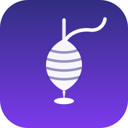
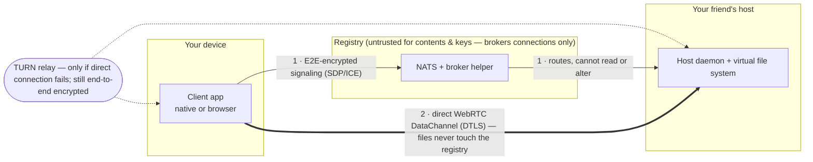

<p align="center"></p>
<h1 align="center">Spindle</h1>
<p align="center">Peer-to-peer file sharing — direct, end-to-end encrypted, no cloud storage in the middle.</p>

Spindle is peer-to-peer file sharing: you run a **host** on your own machine, share chosen
files and directories through a virtual file system, and let approved people browse, download,
and upload according to group entitlements — from a native app or a browser — directly,
peer-to-peer, over WebRTC.

The registry (an operator-run NATS deployment plus a small "broker helper" service) is a
**connection broker and nothing more**. It never holds accounts, never introduces keys, cannot
read file contents or signaling payloads, and cannot alter session setup without detection. All
accounts, shares, groups, and entitlements live only on each host. See
[`docs/DESIGN.md`](docs/DESIGN.md) (the source of truth for this repository) for the full
threat model, protocol, and rationale, and [`docs/adr/`](docs/adr/) for the individual
Architecture Decision Records as they land.

## How it works



1. The host owner shares folders into a virtual tree and sends an invite (QR code or link) —
   the invite itself carries the host's keys, so the registry never introduces them.
2. The invitee redeems it and gets a host-signed capability. Accounts live on the host; the
   registry stores none.
3. Opening the host, the two apps exchange encrypted signaling through the registry, which can
   route the exchange but cannot read or tamper with it.
4. The file transfer runs directly between the two machines, end-to-end encrypted, with
   entitlements enforced by the host on every request.

## Shape: one wire contract, two engines, one UI layer

- **One wire contract** — canonical CBOR schemas and signed-artifact formats (`spindle-proto` /
  `@spindle/proto`) are defined once and verified byte-identical across Rust and TypeScript via
  golden test vectors in CI (see `vectors/`).
- **Two engines** — a Rust engine (`spindle-client-core`, `spindle-host-core`) does everything
  security-relevant (crypto, keys, NATS, WebRTC, VFS) for the native Tauri apps; a pure-TypeScript
  engine (`@spindle/engine-web`) implements the same contract for the browser client. Both are
  reached through one interface, `@spindle/engine-api`, so UI code cannot tell which engine it's
  running on.
- **One UI layer** — React components shared via `@spindle/ui` drive the host admin UI, the
  native client UI, and the web client UI identically.

## Repository tour

```
crates/          Rust workspace: proto, core, net, vfs, host-core, client-core, helper
apps/            host (Tauri tray app), client (Tauri app), web (browser client, no Rust)
packages/        TypeScript workspace: proto, crypto, engine-api, engine-web, engine-tauri,
                 ui, admin, admin-cli
vectors/         golden CBOR/signature test vectors shared by Rust and TypeScript
spikes/          evidence-before-code experiments (DESIGN.md A13); deletable after graduation
deploy/          reference docker-compose deployment (NATS + helper + Postgres + coturn)
docs/            DESIGN.md (authoritative) and docs/adr/ (Architecture Decision Records)
```

This layout follows `docs/DESIGN.md` §A9c exactly; see `docs/adr/ADR-009-repo-layout-toolchain.md`
(once written) for the enumerated boundary rules, including that Tauri frontends receive only
fingerprints and display state over IPC — never keys, seeds, or capabilities.

## Prerequisites & getting started

**Primary path: mise + `just bootstrap`** (ADR-010). [mise](https://mise.jdx.dev) is
the single toolchain front door on all three OSes — it provisions Rust, Node, pnpm,
and `just` from the versions declared once in `mise.toml` (which mirrors
`rust-toolchain.toml`, `.nvmrc`, and the `packageManager` pin, so there's one place to
look). Install it, then bootstrap:

```
brew install mise                    # macOS
curl https://mise.run | sh           # Linux/macOS
winget install jdx.mise              # Windows

just bootstrap
```

`just bootstrap` provisions the pinned tool versions (`mise install`), runs per-OS
native dependency checks (warnings, never a hard fail), and installs JS dependencies
(`pnpm install`). Until `just` itself is installed, run the same script directly — it's
exactly what `just bootstrap` calls, and it installs `just` for you as part of the
pinned toolchain:

```
bash scripts/bootstrap.sh
```

Once bootstrapped, `just build` builds everything; `just --list` shows all targets.

**Alternative: devcontainer / GitHub Codespaces — Linux slice only.**
`.devcontainer/devcontainer.json` builds `Dockerfile.toolchain` (the same image used
for Linux CI toolchain validation) and gives a ready-to-use Linux environment for
`spindle-helper`, the TypeScript packages, and docs. **It cannot build the Tauri apps
or run the native spikes** — Tauri, `keyring`, and other native-OS work need a real
macOS/Windows/Linux host (ADR-010); use the mise path above for that.

**Per-OS native requirements** (checked, non-fatally, by `scripts/bootstrap.sh`):

| OS | Requirement | Check / install |
|----|-------------|------------------|
| macOS | Xcode Command Line Tools | `xcode-select -p` / `xcode-select --install` |
| Windows | MSVC C++ Build Tools (for Tauri) | https://visualstudio.microsoft.com/visual-cpp-build-tools/ |
| Linux | webkit2gtk (for Tauri) | `sudo apt install libwebkit2gtk-4.1-dev build-essential libssl-dev pkg-config` |

## Scaffold status

**This scaffold has not been compile-verified.** It was generated on a machine with no Rust
toolchain (`cargo`) and no `just` installed, so no Rust crate here has been built, tested, or even
`cargo check`ed, and no `justfile` target has been executed end to end. All JSON/YAML/TOML files
were validated syntactically (JSON via `node`, YAML/TOML by careful hand construction) but not
functionally exercised. Treat every crate and package as a structural skeleton — filenames,
dependency lists, and comments matching `docs/DESIGN.md` §A9c — until the first real
implementation stage (see `IMPLEMENTATION_PLAN.md`) builds and tests it for real.

## Where to go next

- [`docs/DESIGN.md`](docs/DESIGN.md) — the authoritative design document (read this first).
- [`docs/adr/`](docs/adr/) — Architecture Decision Records, one per major design area.
- [`IMPLEMENTATION_PLAN.md`](IMPLEMENTATION_PLAN.md) — the staged execution plan for this repo.
